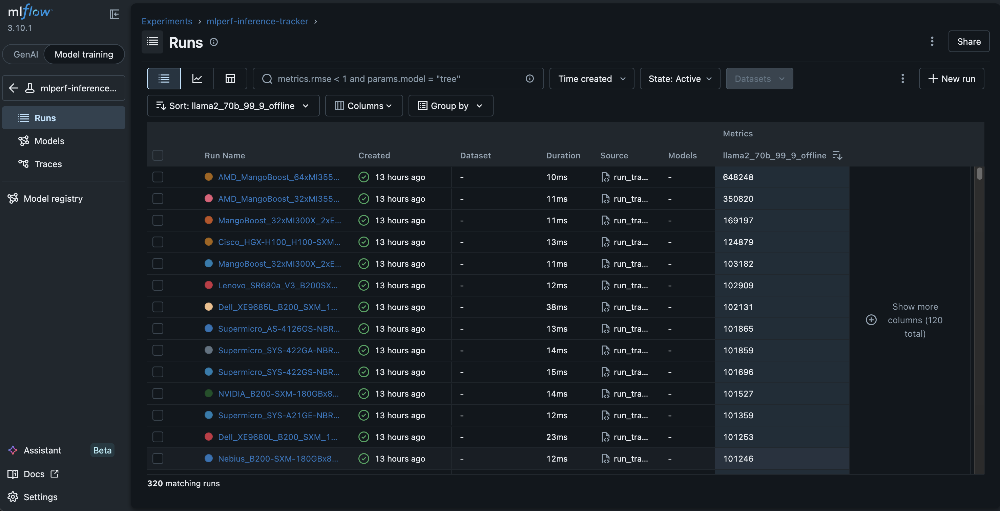
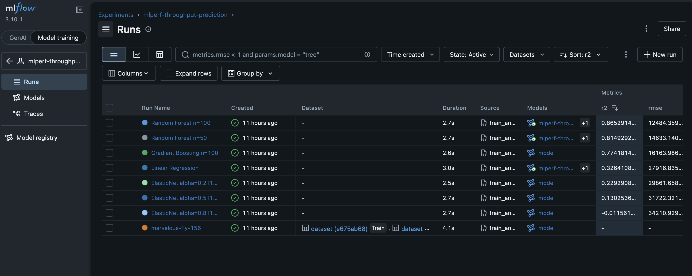
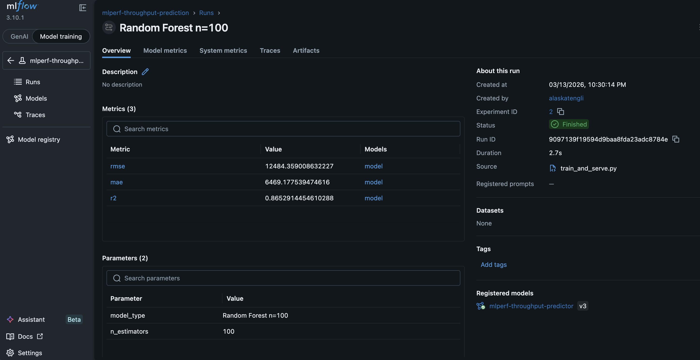
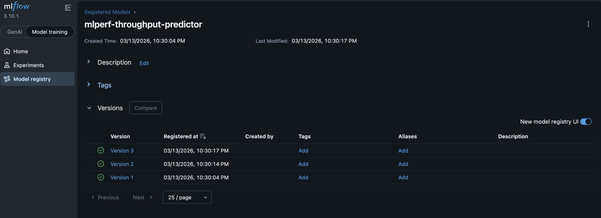
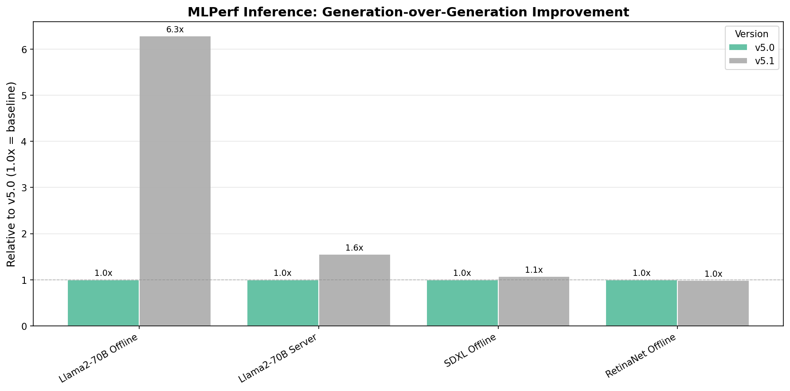
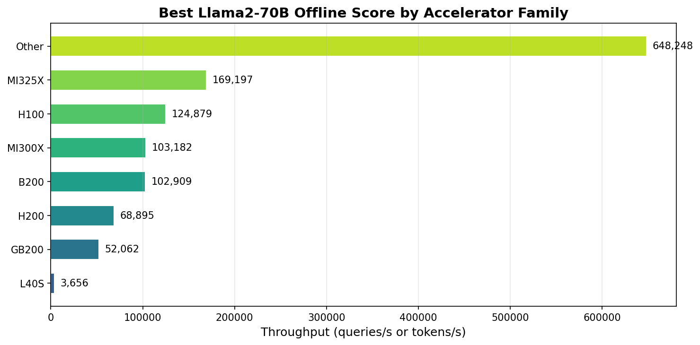
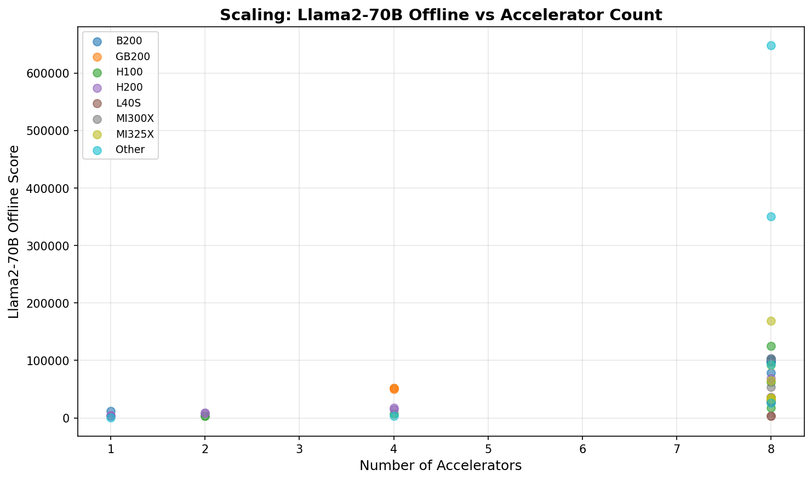

# MLflow Experiment Tracking - MLPerf Inference Results Tracker

## Why This Is Useful

When organizations evaluate hardware for AI inference deployment, they face a fragmented landscape — MLPerf results are scattered across GitHub repos and static HTML tables, making systematic comparison difficult. This project solves that by turning MLflow into an **infrastructure performance observatory**:

- **Hardware procurement teams** can query "show me all 8-GPU systems sorted by Llama2-70B throughput" in one click, instead of manually comparing across MLCommons result pages.
- **ML infrastructure engineers** can track how software stack changes (TensorRT vs vLLM, FP8 vs FP16) affect throughput across hardware generations — the version progression chart showed a **6.3x improvement** from v5.0 to v5.1 on Llama2-70B, mostly driven by new Blackwell GPUs and optimized serving frameworks.
- **Capacity planning** becomes data-driven: the throughput prediction model (R2=0.87) estimates expected inference performance from system specs before purchasing hardware, and the scaling efficiency chart reveals diminishing returns beyond certain GPU counts.

This is the same kind of systems-level performance tracking that HPC teams do when benchmarking clusters across hardware generations — applied to the AI inference stack using MLflow as the backbone.

## Original Lab

Based on [MLflow Experiment Tracking Labs](https://github.com/raminmohammadi/MLOps/tree/main/Labs/Experiment_Tracking_Labs/Mlflow_Labs) from the Northeastern University MLOps course repository.

The original lab demonstrates MLflow's core capabilities: setting up a tracking server with a SQLite backend, logging parameters/metrics/artifacts during model training runs, comparing runs in the MLflow UI, hyperparameter tuning with Hyperopt, and registering models in the Model Registry.

## What I Changed

Instead of tracking ML model training experiments, this project uses MLflow to track **real-world hardware benchmark results** from [MLCommons MLPerf Inference](https://mlcommons.org/benchmarks/inference-datacenter/) — the industry-standard benchmark for measuring AI inference performance across hardware platforms.

### Modifications from Original Lab

| Aspect | Original Lab | My Version |
|---|---|---|
| **Data source** | Synthetic / toy ML training data | Official MLPerf Inference results (v5.0, v5.1) from MLCommons GitHub |
| **What's tracked** | Model training hyperparams + accuracy | Hardware system metadata + inference throughput across accelerators |
| **Parameters logged** | Learning rate, max_depth, regularization | Submitter, accelerator type, GPU count, software stack, MLPerf version |
| **Metrics logged** | RMSE, accuracy | Benchmark scores (Llama2-70B, ResNet50, BERT, SDXL, GPT-J, RetinaNet) + per-accelerator normalized scores |
| **Tags** | Model type | Accelerator family (H100, H200, B200, MI300X, MI325X, etc.) |
| **Scale** | ~10-50 training runs | 320 real system submissions across 37 organizations |
| **Analysis** | Compare hyperparameter configs | Cross-generation accelerator comparison, version-over-version improvement, multi-GPU scaling efficiency |
| **Use case** | "Which hyperparams give the best model?" | "Which hardware + software stack gives the best inference throughput?" |

### MLflow Features Used (Full Lab Coverage)

| Lab Requirement | File | How It's Used |
|---|---|---|
| `mlflow.autolog()` | `train_and_serve.py` Part A | Auto-logs RandomForest params, metrics, and model |
| `mlflow.start_run()` | `train_and_serve.py` Part B, `src/track.py` | Manual run context for 7 models + 320 benchmark runs |
| `mlflow.log_param()` | `train_and_serve.py`, `src/track.py` | Model hyperparams (alpha, l1_ratio, n_estimators) + system specs |
| `mlflow.log_metric()` | `train_and_serve.py`, `src/track.py` | RMSE, MAE, R2 + benchmark throughput scores |
| `mlflow.set_tags()` | `src/track.py` | Accelerator family tags for filtering |
| `infer_signature()` | `train_and_serve.py` Part B | Input/output schema for every trained model |
| `mlflow.sklearn.log_model()` | `train_and_serve.py` Part B | Logs all 7 models with signatures |
| `registered_model_name` | `train_and_serve.py` Part B | Registers best model as `mlperf-throughput-predictor` |
| `mlflow.pyfunc.load_model()` | `train_and_serve.py` Part C | Reloads best model and runs predictions |
| `mlflow models serve` | `train_and_serve.py` Part D | REST API serving instructions + `predict_client.py` |
| `mlflow.search_runs()` | `analyze.py` | Programmatic querying for cross-generation analysis |
| MLflow UI | All | Compare 320+ runs, filter by tags, sort by metrics |

## Key Findings

- **Llama2-70B Offline** best score jumped **6.3x** from v5.0 to v5.1, driven by new Blackwell GPUs and software stack improvements (vLLM, TensorRT-LLM)
- **LLM workloads** saw the largest generation-over-generation gains, while mature CV benchmarks (RetinaNet, SDXL) improved only ~1.0-1.1x
- **MI325X** achieved the highest identified-family score (169K tokens/s) on Llama2-70B Offline among 8-GPU systems
- The **scaling chart** shows clear throughput clustering by accelerator family at each GPU count, with diminishing per-accelerator efficiency at 8 GPUs

## Project Structure

```
mlperf-inference-tracker/
├── README.md
├── requirements.txt
├── run_tracker.py             # Fetch MLPerf results → log to MLflow
├── train_and_serve.py         # Train models → log → register → load → serve
├── predict_client.py          # REST API prediction client
├── analyze.py                 # Cross-generation analysis + plots
├── src/
│   ├── __init__.py
│   ├── fetch_results.py       # Download + parse MLPerf results
│   ├── track.py               # MLflow logging for benchmark data
│   └── utils.py               # Accelerator classification helpers
├── data/                      # Downloaded JSON files (gitignored)
├── analysis_accel_comparison.png
├── analysis_version_progression.png
├── analysis_scaling_efficiency.png
└── EXPERIMENT_REPORT.md
```

## How to Run

```bash
# 1. Set up environment
git clone https://github.com/<your-username>/mlperf-inference-tracker.git
cd mlperf-inference-tracker
python3 -m venv venv && source venv/bin/activate
pip install -r requirements.txt

# 2. Fetch MLPerf results and log to MLflow (320 benchmark runs)
python run_tracker.py

# 3. Train throughput prediction models, register best, load and predict
python train_and_serve.py

# 4. Launch MLflow UI to explore all runs
mlflow ui --backend-store-uri sqlite:///mlflow.db --port 5001
# Open http://localhost:5001

# 5. Serve the best model via REST API
#    Replace <RUN_ID> with the run ID printed by train_and_serve.py (e.g., 9097139f...)
mlflow models serve --env-manager=local -m runs:/<RUN_ID>/model -h 127.0.0.1 -p 5002

# 6. Send prediction requests
python predict_client.py

# 7. Generate analysis charts and report
python analyze.py
```

## Results

### Model Training Results

| Model | RMSE | MAE | R2 |
|---|---|---|---|
| Random Forest n=100 | 12,484 | 6,469 | **0.8653** |
| Random Forest n=50 | 14,633 | 6,980 | 0.8149 |
| Gradient Boosting n=100 | 16,164 | 7,293 | 0.7742 |
| Linear Regression | 27,917 | 18,460 | 0.3264 |
| ElasticNet α=0.2 l1=0.7 | 29,862 | 19,188 | 0.2293 |
| ElasticNet α=0.5 l1=0.5 | 31,722 | 19,745 | 0.1303 |
| ElasticNet α=0.8 l1=0.3 | 34,211 | 22,105 | -0.0116 |

Best model: **Random Forest n=100** — registered in Model Registry as `mlperf-throughput-predictor` (version 3).

Sample predictions from loaded model vs actuals:

| Sample | Predicted (tokens/s) | Actual (tokens/s) |
|---|---|---|
| System 1 | 34,713 | 34,988 |
| System 2 | 34,713 | 34,807 |
| System 3 | 31,153 | 31,175 |

### MLflow UI Screenshots

#### Benchmark tracking (320 MLPerf submissions)


#### Training experiment comparison (8 models)


#### Best run detail (params, metrics, model artifact)


#### Model Registry (3 versions registered)


### Analysis Outputs

### Generation-over-Generation Improvement


### Best Score by Accelerator Family


### Multi-GPU Scaling Efficiency


## Technologies

Python · MLflow (Tracking + UI + Search API) · pandas · Matplotlib · NumPy · Requests

## Data Source

All benchmark data is sourced from the official MLCommons repositories under Apache 2.0 license:
- [inference_results_v5.0](https://github.com/mlcommons/inference_results_v5.0)
- [inference_results_v5.1](https://github.com/mlcommons/inference_results_v5.1)